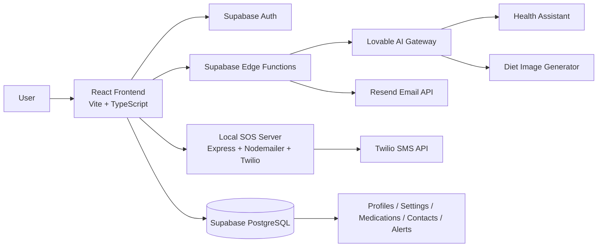

# Bio Sense

## Overview

Bio Sense is a personal health monitoring and emergency response web application built as a React + TypeScript frontend with Supabase for authentication, storage, and database-backed records. The application is organized around a health dashboard, medication reminders, emergency alerts, diet planning, and contact management for personal or family care scenarios.

The repository includes a Vite frontend, Supabase migration scripts, and several Supabase Edge Functions for OTP verification, health alerts, AI-assisted health guidance, and diet image generation. The code shows a design for a health companion that combines routine monitoring with emergency escalation workflows rather than a full medical device integration pipeline.

The repository is strongly evidence-driven around UI state management and backend integrations. Most health readings are simulated in the frontend rather than sourced from a live sensor or device API, and the app uses Supabase tables and local runtime helpers to orchestrate notifications, profile data, and emergency actions.

## Problem Statement

The project addresses a practical need for individuals and families to monitor basic health indicators, manage medications, maintain emergency contacts, and trigger a rapid alert flow when a health emergency is detected. The application brings multiple capabilities together in one dashboard: health status tracking, reminder management, structured emergency contacts, and communication to caregivers.

The repository also includes alert and communication workflows that use email and SMS channels so a user can notify emergency contacts or family members quickly. For the code that is present, the system is designed for a personal health companion rather than a clinical decision-support backbone.

## Objectives

- Provide a health overview dashboard with configurable patient metrics.
- Support medication scheduling and daily dose tracking.
- Maintain emergency contact records and verification flows.
- Send emergency alerts with location context via email and SMS.
- Allow users to sign in using Google OAuth or phone OTP.
- Offer AI-assisted health guidance and diet image generation via backend functions.
- Store user preferences, profile data, and alerts in Supabase.

## Key Features

- Personal health dashboard with simulated health readings and alert feed.
- Medication reminder management with add, edit, toggle, delete, and daily dose tracking.
- Emergency contact management with verification using OTP and activation flags.
- SOS trigger flow that fetches active contacts and sends notifications.
- Location lookup using Nominatim and saved default coordinates.
- Health alert emails via Resend and emergency SMS via Twilio.
- Google Sign-In and phone OTP authentication via Supabase.
- AI health assistant endpoint using a Lovable AI gateway.
- Diet image generation endpoint using a remote image-capable model.
- Supabase Row Level Security applied to user-specific tables.

## Technology Stack

| Category | Technology | Purpose |
| --- | --- | --- |
| Language | TypeScript, JavaScript | Frontend logic and server-side edge functions |
| Frontend | React 18, Vite, Tailwind CSS, shadcn-style UI | Health dashboard and app shell |
| Backend | Supabase Edge Functions, Express | API-like server operations and notification processing |
| Database | Supabase PostgreSQL | User profiles, settings, medications, contacts, alerts |
| APIs | Supabase Auth, Nominatim, Resend, Twilio, Google OAuth | Auth, geocoding, email, SMS |
| LLM/GenAI | Lovable AI gateway, Google Gemini models | Health assistant and diet image generation |
| Deployment | Vite frontend, Supabase hosting functions, local Node SOS server | Runtime execution |
| Testing | Not verified from the repository | No automated test suite was found |

## System Architecture



## End-to-End Data Flow

1. The user signs in through Google OAuth or a phone OTP flow implemented in the frontend and Supabase Auth.
2. The dashboard loads user settings, profile data, medications, and emergency contacts from Supabase.
3. The frontend simulates health readings and updates dashboard metrics in memory.
4. When a threshold is crossed, the app sends a request to the relevant Supabase Edge Function or local SOS server.
5. The emergency or health alert function gathers contact records and sends email or SMS notifications.
6. The AI health assistant function receives chat messages and calls the Lovable AI gateway with a configured Gemini model.
7. Diet image generation calls the same gateway with an image-capable model and returns an image URL.
8. The frontend renders notifications, contact state, medication schedules, and emergency actions to the user.

## Data Preprocessing

No training or data science pipeline is present in this repository. The project does not contain data preparation scripts, feature engineering code, training datasets, or model serialization files.

The actual processing visible in the code is limited to:

- phone number normalization and validation before OTP requests
- location search cleaning for Nominatim queries
- contact filtering by user ID and active status
- date and time formatting for medication reminders and alert timestamps
- simple health metric simulation in the frontend using random adjustments around baseline values

This repository does not include a verified ML preprocessing or dataset pipeline.

## Machine Learning / AI

The repository does not contain a traditional ML training pipeline, model files, evaluation script, or model persistence layer. There is no PyTorch, TensorFlow, scikit-learn, or training notebook evidence in the project files.

AI functionality is present only as remote model calls to the Lovable AI gateway:

- Health assistant: `google/gemini-3-flash-preview`
- Diet image generation: `google/gemini-2.5-flash-image`

These are used through Supabase Edge Functions in:

- `supabase/functions/health-assistant/index.ts`
- `supabase/functions/generate-diet-image/index.ts`

The user input is passed as chat messages or diet plan text, and the model output is returned as a text reply or image URL. No local inference engine, training loop, or evaluation metric logic was found.

## Database

The project uses Supabase PostgreSQL tables backed by SQL migrations. The schema evidence is in the `supabase/migrations` directory.

### Tables observed

- `public.profiles`
  - `id`, `user_id`, `full_name`, `avatar_url`, `setup_complete`, `created_at`, `updated_at`
- `public.user_settings`
  - `id`, `user_id`, `theme`, `weight_unit`, `temperature_unit`, `notify_abnormal`, `notify_caution`, `notify_daily_summary`, `notify_emergency_alerts`, `default_latitude`, `default_longitude`, `default_location_label`, `body_weight`, `height`, `height_unit`
- `public.medications`
  - `id`, `user_id`, `name`, `dosage`, `frequency`, `times`, `notes`, `color`, `active`, `created_at`, `updated_at`
- `public.emergency_contacts`
  - `id`, `user_id`, `name`, `email`, `phone`, `whatsapp`, `contact_type`, `relationship`, `verified`, `is_active`, `notify_on_alerts`, `otp_code`, `otp_expires_at`, `verification_sent_at`, `created_at`, `updated_at`
- `public.alert_notifications`
  - `id`, `user_id`, `contact_id`, `alert_type`, `alert_message`, `sent_at`, `status`
- `public.phone_otps`
  - `id`, `phone`, `otp_code`, `expires_at`, `verified`, `created_at`
- `public.phone_users`
  - `id`, `user_id`, `phone`, `created_at`, `updated_at`

Important implementation details:

- Row Level Security is enabled on the tables.
- Most queries are filtered by `auth.uid() = user_id`.
- `storage.buckets` includes an `avatars` bucket for profile pictures.
- `auth.users` is used as the authentication source for Supabase sessions.

## Backend / API

The code exposes several real endpoints through Supabase Edge Functions and a local express SOS server.

### Supabase Edge Functions

| Method | Endpoint | Purpose |
| --- | --- | --- |
| POST | `/functions/v1/send-phone-otp` | Sends a phone-based OTP via Twilio SMS |
| POST | `/functions/v1/verify-phone-otp` | Verifies a phone OTP and returns an action link |
| POST | `/functions/v1/send-health-alert` | Sends email alerts to contact lists |
| POST | `/functions/v1/health-assistant` | Returns AI health advice from the Lovable AI gateway |
| POST | `/functions/v1/generate-diet-image` | Returns an image URL for a diet plan |
| POST | `/functions/v1/send-sos-alert` | Sends SOS notifications through configured channels |
| POST | `/functions/v1/send-otp` | Generic OTP send flow |
| POST | `/functions/v1/verify-otp` | Generic OTP verification flow |
| POST | `/functions/v1/call-doctor` | Attempts to initiate a Twilio call |

### Local Express server

- `POST /send-sos` in `sos-server.mjs`
  - Reads emergency contacts, location, and timestamp
  - Sends email via Gmail SMTP and SMS via Twilio
  - Returns counts of successful deliveries

## LLM / External AI APIs

The repository contains evidence of external AI usage through the Lovable AI gateway.

- Provider: Lovable AI Gateway
- Models used:
  - `google/gemini-3-flash-preview`
  - `google/gemini-2.5-flash-image`
- Purpose:
  - Health assistant responses
  - Diet image generation for recommended plans
- Request flow:
  1. Frontend calls a Supabase function.
  2. Function reads a `LOVABLE_API_KEY` environment variable.
  3. The function sends a POST request to `https://ai.gateway.lovable.dev/v1/chat/completions`.
  4. Response is returned to the frontend.

No local LLM orchestration, vector database, retrieval pipeline, or agent framework was found in the repository.

## Project Structure

```text
Tech day/
├── package.json
├── vite.config.ts
├── tailwind.config.ts
├── tsconfig.json
├── index.html
├── sos-server.mjs
├── public/
├── src/
│   ├── App.tsx
│   ├── components/
│   ├── data/
│   ├── hooks/
│   ├── integrations/
│   ├── lib/
│   ├── pages/
│   └── types/
├── supabase/
│   ├── config.toml
│   ├── functions/
│   └── migrations/
├── README.md
└── .gitignore
```

## Installation

### Prerequisites

- Node.js and npm
- A Supabase project with the configured database and functions
- Access to the required environment variables

### Setup

```bash
cd "Tech day"
npm install
```

### Environment variables

The code expects frontend environment variables such as:

- `VITE_SUPABASE_URL`
- `VITE_SUPABASE_PUBLISHABLE_KEY`

The backend functions and local server also require variables such as:

- `LOVABLE_API_KEY`
- `RESEND_API_KEY`
- `TWILIO_ACCOUNT_SID`
- `TWILIO_AUTH_TOKEN`
- `TWILIO_PHONE_NUMBER`
- `TWILIO_WHATSAPP_NUMBER`

Values are not included in the repository and must be set in the project environment. Secrets are intentionally not copied here.

### Run the frontend

```bash
npm run dev
```

### Run the emergency notification server

Some emergency flows call a local Express server directly:

```bash
node sos-server.mjs
```

The repository includes a local target at `http://localhost:8083/send-sos`, and some pages also reference `http://localhost:3001/send-sos` as an alternative route.

## Usage

1. Start the frontend with `npm run dev`.
2. Sign in with Google or phone OTP.
3. Complete profile setup if needed.
4. View the dashboard for simulated health readings.
5. Manage medications, contacts, and user settings.
6. Trigger an emergency SOS when needed.
7. Use the AI health assistant for health-related chat guidance.
8. Generate diet-plan image content from the diet planner.

## Testing

No automated test suite or testing framework configuration was found in the repository. The repository includes source files, migrations, and runtime integrations, but no verified `jest`, `vitest`, `pytest`, or `JUnit` setup.

## Deployment

The repository contains evidence of deployment patterns, but not a full production deployment manifest.

Actual deployment evidence includes:

- Vite frontend runtime (`npm run dev`, `npm run build`)
- Supabase Edge Functions deployment model via `supabase/functions`
- Local Node.js emergency server for notification dispatch

No Dockerfile, Kubernetes manifests, or cloud deployment specification was found in the repository.

## Challenges and Solutions

- Schema drift and contact table repairs: the migrations repeatedly fix and rebuild `emergency_contacts` columns and policies, indicating active issues with contact data shape and auth-aware access control.
- Multi-channel alerts: the app handles both email and SMS through different third-party services, with fallback logic to local server routes.
- Authentication complexity: support for Google OAuth and phone OTP required separate Supabase integration logic and session checks.
- Emergency workflow reliability: the repo includes an Express fallback server because the UI sometimes bypasses Edge Functions for urgent alert delivery.
- Location awareness: the app combines saved coordinates with geolocation and Nominatim lookup to enrich emergency alerts.

## Future Improvements

- Replace simulated health data with verified device or API-integrated data sources.
- Add formal automated tests for auth, medication flows, and SOS actions.
- Consolidate duplicate local server paths and standardize notification delivery.
- Add stronger validation and audit logging for emergency alerts.
- Expand the diet, medication, and health guidance logic beyond static examples.

## Author

**Akash T.**

B.Tech Artificial Intelligence & Data Science

---

## Interview Summary

### 30-Second Explanation

Bio Sense is a personal health monitoring dashboard built with React and Supabase. It tracks health metrics, medication schedules, user settings, and emergency contacts, then uses a local alert server and Supabase functions to send SMS and email alerts when the user triggers an SOS or abnormal health condition. It also includes AI-assisted health chat and diet image generation through external model APIs.

### My Technical Role

The repository suggests a role focused on full-stack product development for a health-tech application: frontend UI development, database schema design, backend integrations, authentication flows, and notification logic. The code also shows work with Supabase security policies and external API orchestration, but no direct evidence of formal ML engineering work or a custom training pipeline.

### Technologies I Can Mention

- React 18
- TypeScript
- Vite
- Tailwind CSS
- Supabase Auth
- Supabase PostgreSQL
- Supabase Edge Functions
- Express.js
- Twilio
- Resend
- Nominatim OpenStreetMap
- Lovable AI Gateway
- Google Gemini models

### Important Technical Questions

1. How did you structure the Supabase schema for user profiles, contacts, settings, and alerts?
2. What was the flow for phone OTP authentication and how was it verified?
3. How do you prevent unauthorized access to user-specific tables in Supabase?
4. Why was a local Express SOS server used alongside Supabase functions?
5. How are emergency contacts selected and filtered before an SOS alert is sent?
6. What types of health signals are represented in the dashboard and how are they simulated?
7. How does the health alert function send notifications across email and SMS channels?
8. What is the purpose of the AI health assistant and what external gateway is used?
9. How does the diet planner generate a meal image and what model is being called?
10. What would you change to handle real medical-device data instead of simulated metrics?
