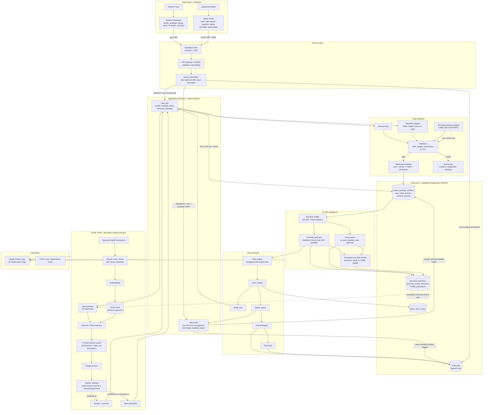
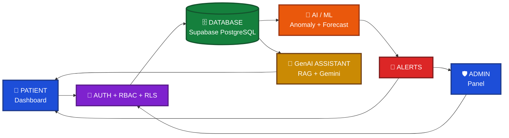
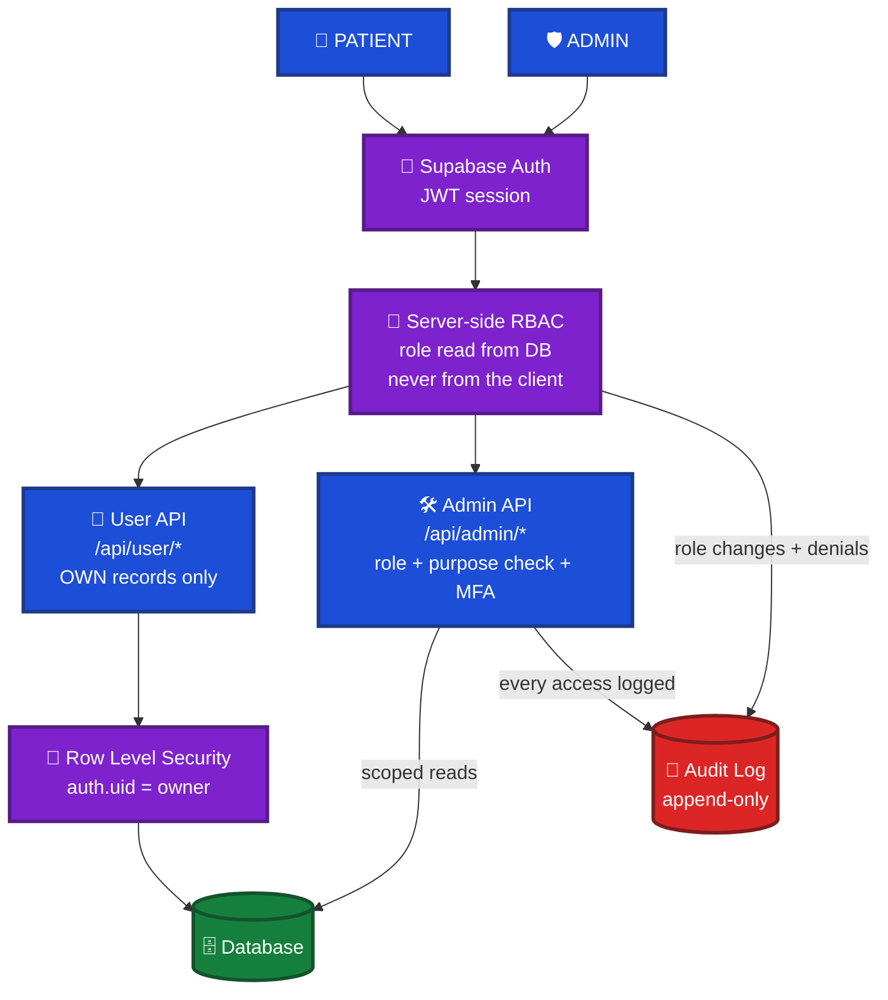
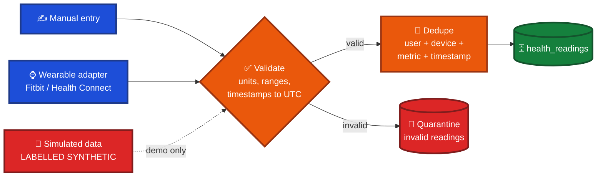
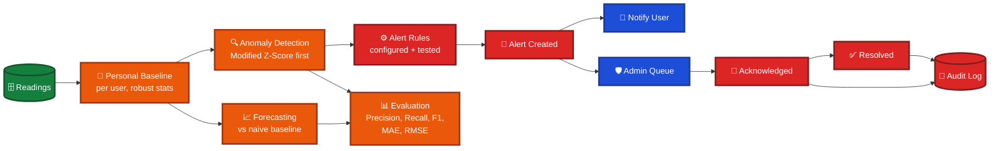
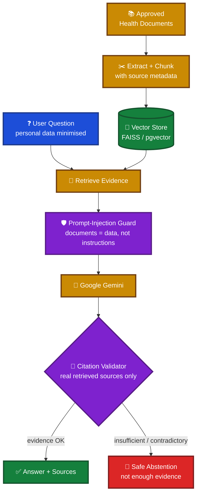
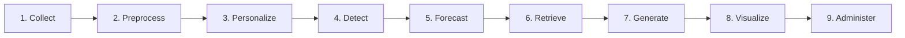

<div align="center">

<!-- Replace with your logo/banner: docs/assets/banner.png -->
<!--  -->

# 🩺 BioSence

### GenAI-Powered Predictive Health Intelligence

**Turning wearable health data into personalized, evidence-grounded insights.**

<br/>


**AI/ML · Generative AI · RAG · Predictive Analytics · Wearable Health Monitoring**

[Overview](#-overview) •
[Features](#-key-features) •
[Architecture](#-system-architecture) •
[Tech Stack](#-technology-stack) •
[Getting Started](#-getting-started) •
[Structure](#-project-structure) •
[Evaluation](#-model-evaluation) •
[Security](#-security-and-privacy) •
[Roadmap](#-roadmap)

</div>

---

> [!WARNING]
> **BioSence is an educational and engineering project, not a medical diagnostic device.** Its outputs are informational only and are **not** a substitute for professional medical advice, diagnosis, or treatment. Always consult a qualified healthcare professional.

---

## 📑 Table of Contents

- [Overview](#-overview)
- [Why BioSence?](#-why-biosence)
- [Project Objectives](#-project-objectives)
- [Key Features](#-key-features)
- [System Architecture](#-system-architecture)
- [Technology Stack](#-technology-stack)
- [How It Works](#-how-it-works)
- [Getting Started](#-getting-started)
- [Project Structure](#-project-structure)
- [Documentation](#-documentation)
- [Model Evaluation](#-model-evaluation)
- [Security and Privacy](#-security-and-privacy)
- [Roadmap](#-roadmap)
- [Contributing](#-contributing)
- [License](#-license)
- [Author](#-author)

---

## 🌟 Overview

**BioSence** is an AI-powered health intelligence platform that analyzes wearable health data, identifies unusual patterns, forecasts health-related trends where the data supports it, and answers questions through a **Generative AI assistant grounded in approved health documents**.

It combines **Machine Learning**, **time-series analytics**, **Retrieval-Augmented Generation (RAG)**, and an interactive **web dashboard** to make personal health data easier to understand and act on, supporting continuous monitoring through personalized insights, anomaly alerts, and trusted health-information retrieval.

<div align="center">

```
Better Data  →  Smarter Insights  →  Healthier Tomorrow
```

</div>

---

## 💡 Why BioSence?

| The problem | The BioSence approach |
| --- | --- |
| Wearable apps show raw numbers with little context | **Personalized baselines** so "normal" is defined per user, not by a population average |
| Generic thresholds cause false alarms | **Statistical + ML anomaly detection** tuned and measured by precision, recall, and false-alarm rate |
| LLM health answers can hallucinate | **RAG with citations** over approved documents, with safe fallback when evidence is lacking |
| Health data is highly sensitive | **Auth, RBAC, and Row Level Security** designed in from the start |
| Demos that only "look good" | **Measurable evaluation** for every AI component |

---

## 🎯 Project Objectives

- [x] Define a clear, measurable scope for health monitoring and insight generation
- [ ] Monitor physiological data from compatible wearable devices or datasets
- [ ] Establish personalized baselines from historical measurements
- [ ] Detect unusual patterns using statistical and machine-learning techniques
- [ ] Forecast future trends when suitable longitudinal data is available
- [ ] Provide evidence-grounded explanations using Generative AI and RAG
- [ ] Present trends and alerts through an interactive dashboard
- [ ] Support authorized caregiver and administrator monitoring
- [ ] Protect personal health information with authentication and access controls

> Update the checkboxes as features are implemented and verified.

---

## ✨ Key Features

### 👤 Personal Health Dashboard

- Personal profile and health-data management
- Health readings with historical trend visualizations
- Personalized baseline monitoring
- Anomaly alerts and health-information assistance
- User-specific access to personal records only

### 🛡️ Administrative Dashboard

- Registered-user management
- Authorized health-data and trend monitoring
- Alert review and status management
- Role-based permissions and audit logging

> 🚧 *Planned / in progress until implementation is verified in the repository.*

### ⌚ Wearable Health Integration

| Metric | Description |
| --- | --- |
| ❤️ Heart rate | Resting and active heart-rate readings |
| 🩸 SpO₂ | Blood oxygen saturation |
| 📉 HRV | Heart-rate variability |
| 😴 Sleep | Duration and patterns |
| 🏃 Activity | Physical activity and movement |

> Actual data availability depends on the connected device, official API, user permissions, and platform limitations.

### 🧠 AI-Powered Anomaly Detection

- Personalized baseline calculation per user
- Statistical detection using methods such as **Modified Z-Score** (median/MAD-based, robust to outliers)
- Extensible to ML approaches (e.g., Isolation Forest)
- Evaluated with **precision, recall, F1-score, and false-alarm rate**

### 📈 Predictive Analytics

- Historical time-series analysis
- Trend forecasting where the data supports it
- Evaluated with **MAE** and **RMSE**
- **Time-aware validation** to prevent data leakage

### 💬 GenAI Health Assistant

- Retrieval-Augmented Generation over approved health-information documents
- Context-grounded answers with **source citations**
- Evidence-aware responses
- **Safe refusal / fallback** when supporting evidence is insufficient

---

# BioSence System Architecture

> **Status:** Intended architecture. Components are marked as implemented, partial, or planned as development progresses.
> BioSence is a monitoring and decision-support prototype, **not** a diagnostic medical device.




## Design Decisions

| Area | Decision |
|---|---|
| **User vs admin** | Separate entry points and API namespaces (`/api/user/*`, `/api/admin/*`); one server-side RBAC check that reads the role from the database |
| **Admin safety** | Scoped, purpose-limited reads; MFA required; every sensitive access written to the append-only audit log |
| **Patient isolation** | Row Level Security (`auth.uid() = owner`) enforced in the database, so isolation holds even if an API route has a bug |
| **Ingestion** | Validation, idempotent dedupe key, and quarantine for invalid readings |
| **Simulated data** | Separate adapter, always labelled synthetic, never presented as live wearable data |
| **RAG** | Prompt-injection guard, citation validator, and safe abstention when evidence is insufficient |
| **Alerts** | Rule → alert → user notification + admin queue → acknowledged → resolved, with each step audited |
| **Evaluation** | Metrics and drift monitoring stored with model version metadata |


# 🧬 BioSence Explained Architecture

> **Status:** Intended architecture. Update the status table at the bottom as features are built and tested.
> ⚠️ BioSence is a monitoring and decision-support prototype, **not** a diagnostic medical device.

### 🎨 Legend

| Color | Meaning |
|---|---|
| 🟦 Blue | Users and client apps |
| 🟪 Purple | Security and access control |
| 🟩 Green | Data storage |
| 🟧 Orange | AI / ML |
| 🟥 Red | Alerts, quarantine, audit |
| 🟨 Yellow | GenAI / RAG |

---

## 1️⃣ Big Picture



---

## 2️⃣ Patient vs Admin Access



| | 👤 Patient | 🛡️ Admin |
|---|---|---|
| **Sees** | Own data only | Only what the role and purpose allow |
| **Enforced by** | RLS in the database | RBAC + purpose check + MFA |
| **Logged** | Normal activity | **Every** sensitive access |

---

## 3️⃣ Data Ingestion



---

## 4️⃣ AI / ML and Alert Lifecycle



---

## 5️⃣ GenAI Assistant (RAG)



> The assistant never diagnoses. It separates measured readings, algorithm flags, and general health information.

---

## ✅ Component Status

| Component | Status |
|---|---|
| 👤 Patient dashboard | ⬜ Planned |
| 🛡️ Admin panel | ⬜ Planned |
| 🔐 Auth + RLS | ⬜ Planned |
| 🔁 Ingestion + validation | ⬜ Planned |
| 🔍 Anomaly detection | ⬜ Planned |
| 📈 Forecasting | ⬜ Planned |
| 💬 RAG assistant | ⬜ Planned |
| ⌚ Wearable integration | ⬜ Planned |

**Status key:** ⬜ Planned · 🟨 Partial · 🟩 Implemented and tested · 🟥 Blocked

## Design Decisions

| Area | Decision |
|---|---|
| **User vs admin** | Separate entry points and API namespaces (`/api/user/*`, `/api/admin/*`); one server-side RBAC check that reads the role from the database |
| **Admin safety** | Scoped, purpose-limited reads; MFA required; every sensitive access written to the append-only audit log |
| **Patient isolation** | Row Level Security (`auth.uid() = owner`) enforced in the database, so isolation holds even if an API route has a bug |
| **Ingestion** | Validation, idempotent dedupe key, and quarantine for invalid readings |
| **Simulated data** | Separate adapter, always labelled synthetic, never presented as live wearable data |
| **RAG** | Prompt-injection guard, citation validator, and safe abstention when evidence is insufficient |
| **Alerts** | Rule → alert → user notification + admin queue → acknowledged → resolved, with each step audited |
| **Evaluation** | Metrics and drift monitoring stored with model version metadata |


*Update the status column as each component is implemented and tested.*

## 🛠️ Technology Stack

| Layer | Technologies |
| --- | --- |
| **Languages** | Python, TypeScript, SQL |
| **Frontend** | React, Vite, Tailwind CSS |
| **Backend** | FastAPI (where required) |
| **Database** | PostgreSQL, Supabase |
| **Authentication** | Supabase Auth |
| **AI / ML** | NumPy, Pandas, Scikit-learn |
| **Generative AI** | Google Gemini |
| **LLM Orchestration** | LangChain |
| **Vector Search** | FAISS + embeddings |
| **Deployment** | Docker, cloud hosting |
| **Version Control** | Git, GitHub |

> The actual stack may differ depending on the existing codebase. Technologies not yet implemented should be treated as planned integrations.

---

## 🔄 How It Works



| # | Stage | What happens |
| --- | --- | --- |
| 1 | **Data collection** | Readings from a supported wearable API, manual entry, or a clearly identified dataset |
| 2 | **Preprocessing** | Validate measurements, handle missing values, normalize timestamps, check data quality |
| 3 | **Personalization** | Build an appropriate baseline from historical data |
| 4 | **Anomaly detection** | Flag unusual patterns using validated statistical or ML methods |
| 5 | **Predictive analytics** | Forecast trends when enough history exists |
| 6 | **Knowledge retrieval** | Pull relevant passages from approved health documents |
| 7 | **GenAI response** | Generate explanations grounded in retrieved evidence |
| 8 | **Visualization** | Show readings, trends, alerts, and sources in the dashboard |
| 9 | **Secure administration** | Authorized admins monitor users and alerts per assigned permissions |

---

## 🚀 Getting Started

### Prerequisites

- Python **3.11+**
- Node.js **18+** and npm
- A [Supabase](https://supabase.com) project
- A [Google Gemini API key](https://aistudio.google.com/)
- Docker and Docker Compose (optional, recommended)
- `make` (optional, for shortcuts)

### 1. Clone the repository

```bash
git clone https://github.com/akashtcaa2005/Bio-sense.git
cd Bio-sense
```

### 2. Configure environment variables

```bash
cp .env.example .env
```

Then fill in your values (never commit `.env`):

```env
# Supabase
SUPABASE_URL=your_supabase_project_url
SUPABASE_ANON_KEY=your_supabase_anon_key
SUPABASE_SERVICE_ROLE_KEY=your_service_role_key   # backend only, never expose to the client

# Generative AI
GEMINI_API_KEY=your_gemini_api_key

# App
APP_ENV=development
```

### 3. Quick start with helper scripts

```bash
bash scripts/setup.sh        # install backend + frontend dependencies
bash scripts/migrate.sh      # apply database migrations
bash scripts/start-dev.sh    # start backend and frontend in dev mode
```

### 4. Or run each part manually

**Backend**

```bash
cd app/backend
python -m venv .venv
source .venv/bin/activate            # Windows: .venv\Scripts\activate
pip install -r requirements.txt
uvicorn src.main:app --reload        # API on http://localhost:8000
```

**Frontend**

```bash
cd app/frontend
npm install
npm run dev                          # App on http://localhost:5173
```

### 5. Run with Docker

```bash
docker compose up --build
```

### 6. Run the tests

```bash
# Backend unit + integration tests
cd app/backend && pytest src/tests

# End-to-end and smoke tests (from the repo root)
# see tests/e2e and tests/smoke
```

---

## 🗂️ Project Structure

```text
Bio-sense/
├── README.md
├── LICENSE
├── .gitignore
├── .env.example                 # Template for environment variables
├── package.json                 # Root JS/TS tooling
├── pyproject.toml               # Python project configuration
├── requirements.txt
├── Dockerfile
├── docker-compose.yml
├── Makefile                     # Automation shortcuts
│
├── app/
│   ├── backend/
│   │   ├── requirements.txt
│   │   └── src/
│   │       ├── main.py          # Application entry point
│   │       ├── api/
│   │       │   ├── routes/      # Endpoint definitions
│   │       │   ├── middleware/  # Auth, logging, rate limiting
│   │       │   └── controllers/ # Request handling logic
│   │       ├── core/
│   │       │   ├── config/      # Settings and environment loading
│   │       │   ├── security/    # Auth, RBAC, access checks
│   │       │   └── utils/
│   │       ├── models/          # Data models
│   │       ├── schemas/         # Request/response validation
│   │       ├── services/        # Business logic: anomaly detection,
│   │       │                    # forecasting, RAG, alerts
│   │       ├── db/
│   │       │   ├── migrations/
│   │       │   └── seeders/
│   │       └── tests/
│   │           ├── unit/
│   │           └── integration/
│   │
│   ├── frontend/
│   │   ├── package.json
│   │   ├── vite.config.ts
│   │   ├── public/
│   │   └── src/
│   │       ├── app/             # App shell and routing
│   │       ├── components/      # Reusable UI components
│   │       ├── features/        # Dashboard, alerts, assistant, admin
│   │       ├── hooks/
│   │       ├── services/        # API clients
│   │       ├── store/           # State management
│   │       ├── styles/
│   │       └── utils/
│   │
│   └── shared/
│       ├── types/               # Shared TypeScript types
│       ├── constants/
│       └── helpers/
│
├── docs/
│   ├── architecture.md
│   ├── api.md
│   └── deployment.md
│
├── scripts/
│   ├── setup.sh
│   ├── start-dev.sh
│   └── migrate.sh
│
├── tests/
│   ├── e2e/                     # End-to-end user flows
│   ├── smoke/                   # Quick post-deploy checks
│   └── fixtures/                # Sample data for tests
│
└── .github/
    ├── workflows/
    │   ├── ci.yml               # Lint + test on every push/PR
    │   └── deploy.yml           # Deployment pipeline
    └── ISSUE_TEMPLATE/
```

---

## 📚 Documentation

| Document | Description |
| --- | --- |
| [Architecture](docs/architecture.md) | System design, data flow, and component responsibilities |
| [API Reference](docs/api.md) | Endpoints, request/response schemas, and auth |
| [Deployment](docs/deployment.md) | Docker, environment setup, and hosting guide |

---

## 📊 Model Evaluation

BioSence relies on **measurable evaluation**, not just visual demos.

| Component | Metrics |
| --- | --- |
| 🚨 Anomaly detection | Precision, recall, F1-score, false-alarm rate |
| 📈 Predictive analytics | MAE, RMSE, temporal validation |
| 🔎 RAG retrieval | Recall@K, Precision@K, MRR |
| 💬 GenAI responses | Groundedness, citation correctness, relevance |
| ⚙️ Application | Test coverage, latency, reliability, access-control tests |

### Results

> Fill these in once experiments are complete. Report the dataset used and the validation method.

| Component | Metric | Result |
| --- | --- | --- |
| Anomaly detection | F1-score | _TBD_ |
| Forecasting | MAE / RMSE | _TBD_ |
| RAG retrieval | Recall@5 | _TBD_ |
| GenAI | Groundedness | _TBD_ |

---

## 🔐 Security and Privacy

Design principles:

- 🔑 Authentication and role-based authorization
- 🧱 Database-level **Row Level Security (RLS)**
- 👤 User ownership checks on personal health records
- 🚪 Restricted administrative access
- 🗝️ API credentials handled via environment variables
- 🧼 Minimal collection and exposure of sensitive information
- 📜 Auditable access to sensitive records
- 🤖 Careful handling of health data sent to external AI services

> [!NOTE]
> These are **design goals**. Their implementation and effectiveness must be verified through security testing (e.g., access-control and authorization tests).

Found a vulnerability? Please report it privately through the contact details below rather than opening a public issue.

---

## 🗺️ Roadmap

-  Wearable data ingestion pipeline
-  Personalized baseline engine
-  Modified Z-Score anomaly detection
-  ML-based anomaly detection extension
-  Time-series forecasting module
-  RAG pipeline with approved document corpus and citations
-  Interactive user dashboard
-  Admin dashboard with audit logging
-  RLS policies and access-control test suite
-  Evaluation report with published metrics
-  Dockerized deployment
-  CI/CD pipeline (GitHub Actions) with automated tests

---

## 🤝 Contributing

Contributions, feedback, and technical suggestions are welcome.

1. Open an issue to discuss significant changes first
2. Fork the repository
3. Create a feature branch: `git checkout -b feature/your-feature`
4. Commit your changes: `git commit -m "feat: add your feature"`
5. Make sure tests pass locally; the CI workflow (`.github/workflows/ci.yml`) runs on every pull request
6. Push and open a pull request

---

## 📄 License

Distributed under the terms of the [LICENSE](LICENSE) file in this repository.

---

## 👨‍💻 Author

**Akash T.**
Final-year B.Tech, Artificial Intelligence & Data Science

[](https://github.com/akashtcaa2005)
[](https://linkedin.com/in/akash-t-845439314/)

---

<div align="center">

**🩺 BioSence**

*Better Data → Smarter Insights → Healthier Tomorrow*

⭐ If you find this project interesting, consider giving it a star!

</div>
