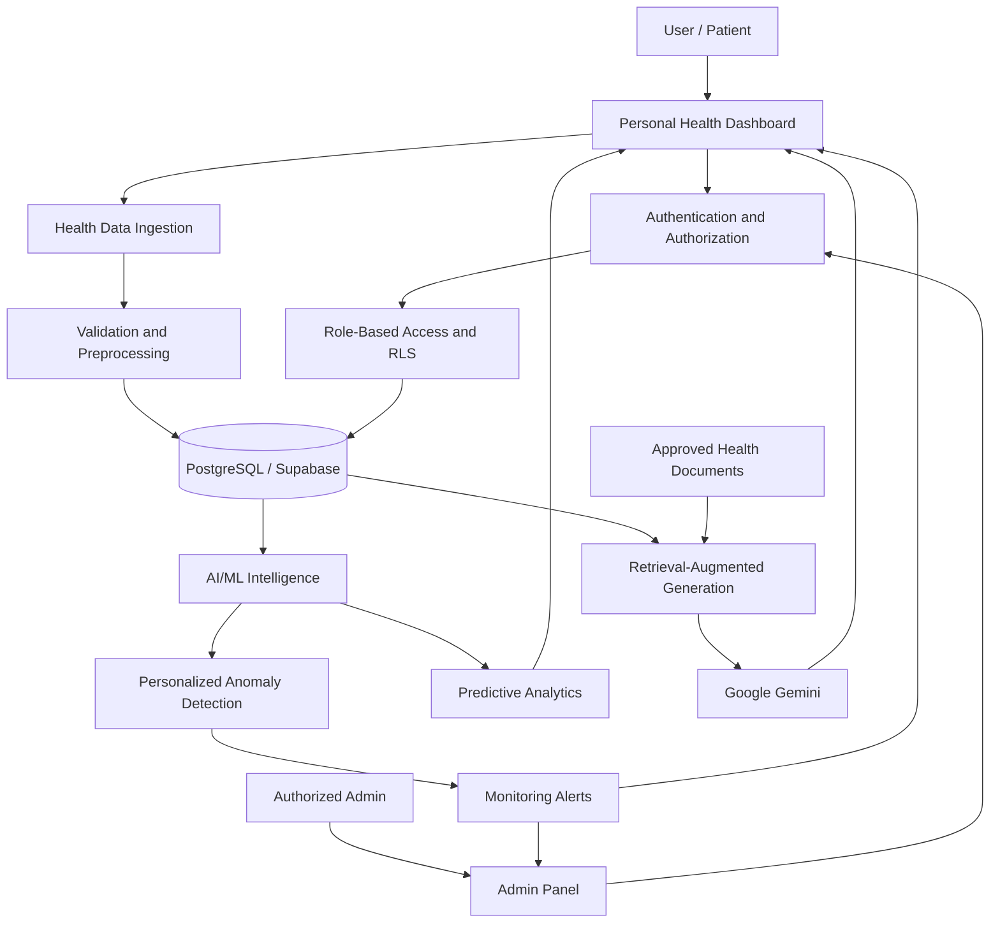

# 🩺 BioSence — GenAI-Powered Predictive Health Intelligence

  <strong>Turning wearable health data into personalized, evidence-grounded insights.</strong>

  AI/ML · Generative AI · RAG · Predictive Analytics · Wearable Health Monitoring

---

## 🌟 Overview

**BioSence** is an AI-powered health intelligence platform designed to analyze wearable health data, identify unusual patterns, forecast health-related trends where supported by sufficient data, and provide evidence-grounded information through a Generative AI assistant.

The platform combines Machine Learning, time-series analytics, Retrieval-Augmented Generation (RAG), and a web-based dashboard to make health data easier to understand.

BioSence aims to support continuous health monitoring and informed decision-making through personalized insights, anomaly alerts, and trusted health-information retrieval.

> **Disclaimer:** BioSence is an educational and engineering project, not a medical diagnostic device. Its outputs are not a substitute for professional medical advice.

## 🎯 Project Objectives

* Monitor physiological data from compatible wearable devices or datasets.
* Establish personalized baselines from historical measurements.
* Detect unusual patterns using statistical and machine-learning techniques.
* Forecast future trends when suitable longitudinal data is available.
* Provide evidence-grounded explanations using Generative AI and RAG.
* Present health trends and alerts through an interactive dashboard.
* Support authorized caregiver and administrator monitoring.
* Protect personal health information through authentication and access controls.

## ✨ Key Features

### 👤 Personal Health Dashboard

* Personal profile and health-data management.
* Health readings and historical trend visualizations.
* Personalized baseline monitoring.
* Anomaly alerts and health-information assistance.
* User-specific access to personal records.

### 🛡️ Administrative Dashboard

* Registered-user management.
* Authorized health-data and trend monitoring.
* Alert review and status management.
* Role-based permissions and audit logging.

*The administrative dashboard is a planned or in-progress feature until its implementation is verified in the repository.*

### ⌚ Wearable Health Integration

Potential metrics include:

* Heart rate
* Blood oxygen saturation (SpO₂)
* Heart-rate variability (HRV)
* Sleep duration and patterns
* Physical activity and movement

Actual data availability depends on the connected device, official API, user permissions, and platform limitations.

### 🧠 AI-Powered Anomaly Detection

* Personalized baseline calculation.
* Statistical anomaly detection using methods such as Modified Z-Score.
* Potential machine-learning extensions.
* Evaluation using precision, recall, F1-score, and false-alarm rates.

### 📈 Predictive Analytics

* Historical time-series analysis.
* Trend forecasting where supported by the data.
* Evaluation using MAE and RMSE.
* Time-aware model validation to reduce data leakage.

### 💬 GenAI Health Assistant

* Retrieval-Augmented Generation.
* Search over approved health-information documents.
* Context-grounded answers.
* Source citations and evidence-aware responses.
* Safe handling of questions that lack sufficient supporting evidence.

## 🏗️ System Architecture

This diagram represents the intended architecture. Components and connections should be updated as implementation progresses.

## 🛠️ Technology Stack

| Layer                 | Technologies                |
| --------------------- | --------------------------- |
| Programming languages | Python, TypeScript, SQL     |
| Frontend              | React, Vite, Tailwind CSS   |
| Backend               | FastAPI, where required     |
| Database              | PostgreSQL, Supabase        |
| Authentication        | Supabase Auth               |
| AI/ML                 | NumPy, Pandas, Scikit-learn |
| Generative AI         | Google Gemini               |
| LLM orchestration     | LangChain                   |
| Vector search         | FAISS and embeddings        |
| Deployment            | Docker and cloud hosting    |
| Version control       | Git and GitHub              |

The actual stack may differ depending on the existing codebase. Technologies that are not yet implemented should be considered planned integrations.

## 🔄 Project Workflow

1. **Data collection:** Obtain health readings from a supported wearable API, manual entry, or a clearly identified dataset.
2. **Preprocessing:** Validate measurements, handle missing values, normalize timestamps, and check data quality.
3. **Personalization:** Establish an appropriate baseline using historical data.
4. **Anomaly detection:** Identify unusual patterns using validated statistical or ML methods.
5. **Predictive analytics:** Forecast trends when sufficient historical data exists.
6. **Knowledge retrieval:** Retrieve relevant passages from approved health documents.
7. **GenAI response:** Generate explanations grounded in retrieved evidence.
8. **Visualization:** Present readings, trends, alerts, and sources through the dashboard.
9. **Secure administration:** Allow authorized administrators to monitor users and alerts according to assigned permissions.

## 🔐 Security and Privacy

BioSence is designed with the following security principles:

* Authentication and role-based authorization.
* Database-level Row Level Security (RLS).
* User ownership checks for personal health records.
* Restricted administrative access.
* Secure handling of API credentials through environment variables.
* Minimal collection and exposure of sensitive information.
* Auditable access to sensitive records.
* Careful handling of health data sent to external AI services.

These are design goals; their implementation and effectiveness must be verified through security testing.

## 📊 Model Evaluation

BioSence will use measurable evaluation rather than relying only on visual demonstrations.

| Component            | Evaluation                                                |
| -------------------- | --------------------------------------------------------- |
| Anomaly detection    | Precision, recall, F1-score, false-alarm rate             |
| Predictive analytics | MAE, RMSE, temporal validation                            |
| RAG retrieval        | Recall@K, Precision@K, MRR where appropriate              |
| GenAI responses      | Groundedness, citation correctness, relevance             |
| Application          | Test coverage, latency, reliability, access-control tests |

## 👨‍💻 Project Information

**Project:** BioSence — GenAI-Powered Predictive Health Intelligence

**Domain:** Artificial Intelligence, Machine Learning, Generative AI, Digital Health

**Project Type:** Final-year B.Tech Artificial Intelligence and Data Science project

**Developer:** Akash T.

**GitHub:** [akashtcaa2005](https://github.com/akashtcaa2005)

**LinkedIn:** [Akash T.](https://linkedin.com/in/akash-t-845439314/)

## 🤝 Contributions

Contributions, feedback, and technical suggestions are welcome. Please open an issue to discuss significant changes before submitting a pull request.

## 📄 License

Choose and add an appropriate open-source license before distributing this repository. Until a license is added, do not assume others have permission to reuse the project's code.

---

  <strong>BioSence</strong> 
  Better Data → Smarter Insights → Healthier Tomorrow

